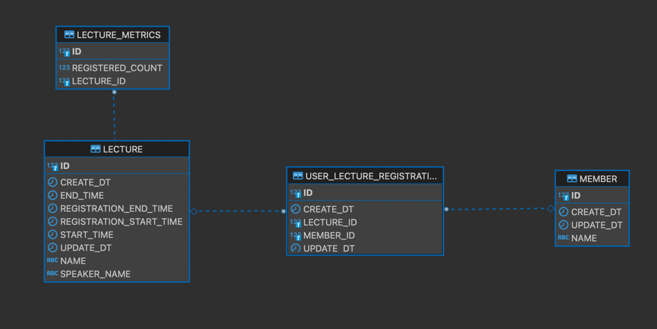

# 특강 신청 APPLICATION

사용자가 강의를 신청하는 애플리케이션으로, 아래와 같은 요구 사항을 충족하는 것을 목적으로 한다.

1. 한 강의 신청을 30명을 초과하여 할 수 없으며, 동시성에 대한 문제도 없어야 한다.
2. 한 사용자가 같은 강의를 여러번 신청하는 경우, 한번만 성공하고 나머지는 실패해야 한다.

## ERD

1. Member : 사용자 엔티티

2. Lecture : 강의 엔티티

3. UserLectureRegistration
    - 사용자 강의 신청 테이블
    - Member 와 Lecture 의 Many To Many 관계를 관계형 데이터 베이스에 표현하기 위한 관계형 테이블

4. LectureMetrics : 강의 통계 정보 테이블
    - 강의 통계 정보를 저장할 테이블
    - 강의 관련 통계를 특강 테이블에서 조회하여 계산하는 경우, 리소스 낭비가 예상되어 생성
    - 강의 등록시 30명 제한에 동시성 문제를 해결하기 위해서 비관적 lock을 사용하는 테이블(비관적 락이 여러 레코드에 걸리는 것을 피함)

---